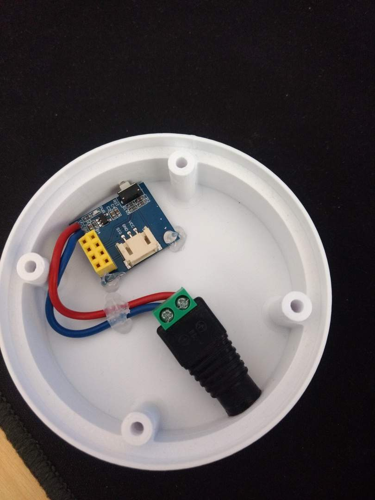
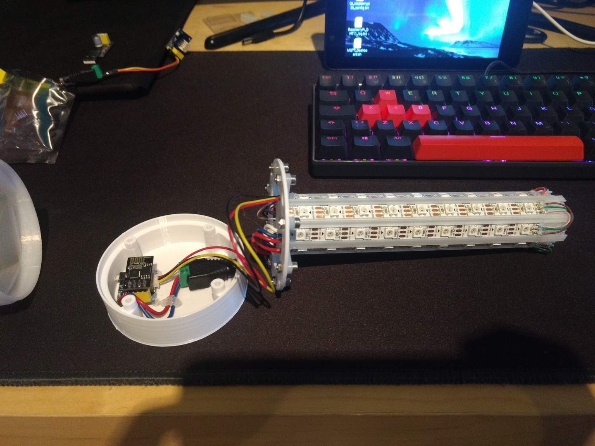

# esp8266_NeoPixel

## About

MQTT NeoPixel control using a esp8266 based board (ESP-01S). Platformio project
file for convenience.

## Requirements

- ESP-01 board
- [ESP-01 RGB Board](https://www.aliexpress.com/item/32843759597.html)
- WS2812 WS2812B n Bits Light Ring (I used 16 Bits) (Adafruit NeoPixel)
- 3-5V supply or battery


- [Visual Studio Code](https://code.visualstudio.com/) (or Codium) with:
  - [PlatformIO extension](https://platformio.org/) with platform Espressif
    8266 installed (configuration for the board in
    [platformio.ini](platformio.ini))

## Demo

(Tested with MQTT_Dashboard)


## RGB Lamp

Some improvements to create something similar to [**Twisted WiFi-controlled
Desk Lamp**](https://www.thingiverse.com/thing:4129249):

- Drilled base to have access to reset button



- Using ESP-01 and ESP-01 RGB Board instead of Weemos D1 mini



Finished lamp with MQTT Dashboard demo:


## References and links

- Libraries and code based on examples from the [Unofficial SDK](https://programs74.ru/udkew-en.html)
  for Espressif ESP8266
- [Adafruit NeoPixel Arduino Library](https://github.com/adafruit/Adafruit_NeoPixel)

## Important notes

It is important that the user modifies the corresponding fields between
```< >``` in the file ```src/user_config.h```

## TODO

- Implement initial SSID and Password configuration by setting the ESP as an
  Access Point, displaying a welcome site and have the user input stored in the
  device
- ~~Standalone light effects~~

## Contributing

Feel free to drop a line/contact me if interested in this project

